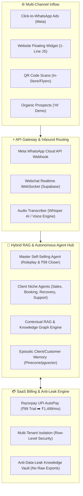

# 🏛️ MASTER SYSTEM ARCHITECTURE: GOD-LEVEL AUTONOMOUS WHATSAPP AI AGENT SAAS

**Version:** 1.0.0 (Production Blueprint)  
**Last Updated:** 2026-10-02  
**Status:** Living Master Specification  

---

## 1. Executive Summary & Vision
This platform is a **Self-Selling, Autonomous 24/7 AI Employee SaaS** built on top of the **Official WhatsApp Cloud API (WACA)**, **Next.js 16 / React 19**, **Supabase Realtime PostgreSQL**, and **Razorpay Subscriptions (UPI AutoPay)**.

It eliminates manual customer support, missed inquiries, and sales drop-offs by providing an intelligent AI closer that speaks Hindi/Hinglish/English, transcribes voice notes, demonstrates live roleplays to acquire new clients, collects payments inside WhatsApp, and continuously interviews business owners to expand its knowledge base.

---

## 2. High-Level Architecture Diagram

---

## 3. Tech Stack Breakdown

| Component | Selected Technology | Rationale |
| :--- | :--- | :--- |
| **Frontend UI** | Next.js 16 (App Router), React 19, Tailwind CSS v4, Shadcn UI | Blazing fast, 100% fluid auto-fit, dark/light theme, modern micro-interactions. |
| **Visual Flow Engine** | `@xyflow/react` (xyflow node graph) | ManyChat-grade drag-and-drop workflow visualizer. |
| **Database & Auth** | Supabase (PostgreSQL 16) + Row-Level Security (RLS) | Realtime chat subscriptions, zero server maintenance, multi-tenant isolation. |
| **AI Models & Router** | Groq (Llama-3.3-70B / Qwen-2.5-Coder), OpenAI (`text-embedding-3-small` / Whisper), DeepSeek-R1 | Zero latency, multi-provider fallback, infinite reliability. |
| **Vector DB / RAG** | PostgreSQL `pgvector` / Supabase Vector | Semantic search, Parent-Child chunking, Entity linking. |
| **Billing & Payments** | Razorpay Subscriptions (UPI AutoPay / E-Mandate) | High conversion in India with ₹99 low-friction trial. |
| **Hosting & CI/CD** | Vercel (Edge Functions + Serverless) + GitHub | Zero DevOps overhead, 99.99% uptime. |

---

## 4. Multi-Tenant Data Isolation Model

- **Organization / Tenant Level:** Every business has a unique `organization_id` / `vendor_id`.
- **Row Level Security (RLS):** Enabled on all Supabase tables (`contacts`, `messages`, `knowledge_nodes`, `orders`, `pipelines`).
- **White-Label Client Isolation:** Client dashboards only have access to their scoped data. Master credentials, AI routing keys, and server telemetry are restricted strictly to SuperAdmin.

---

## 5. Security & Anti-Leak Policy
1. **No Raw Knowledge Export:** Clients cannot download full trained embeddings or knowledge graphs as bulk CSV/PDF.
2. **Encrypted Credentials:** Meta System User Permanent Tokens and Razorpay API secrets are stored AES-256 encrypted.
3. **Webhook Verification:** HMAC SHA-256 signature verification on all incoming Meta WhatsApp webhooks.
