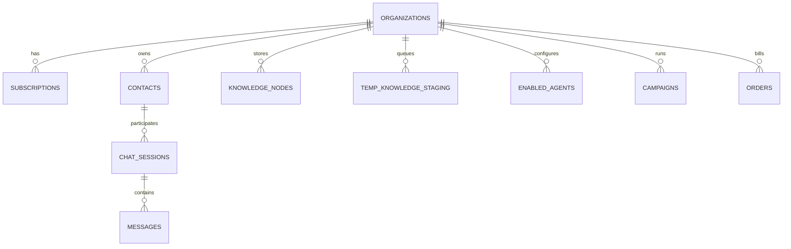

# 🗄️ DATABASE SCHEMA & MIGRATIONS SPECIFICATION

**Version:** 1.0.0  
**Target:** PostgreSQL 16 (Supabase) with Row-Level Security (RLS) and pgvector  

---

## 1. Entity Relationship Overview

---

## 2. Core Tables Specification

### 1. `organizations` (Tenants / Business Owners)
- `id` (UUID, Primary Key)
- `name` (TEXT)
- `owner_phone` (TEXT, UNIQUE - Used for WhatsApp Interviewer mapping)
- `waba_id` (TEXT, Meta WhatsApp Business Account ID)
- `phone_number_id` (TEXT, Meta Phone ID)
- `access_token` (TEXT, AES-256 Encrypted)
- `status` (ENUM: 'trial', 'active', 'past_due', 'canceled')
- `created_at` (TIMESTAMPTZ)

### 2. `subscriptions` (Razorpay UPI AutoPay Subscriptions)
- `id` (UUID, PK)
- `organization_id` (UUID, FK -> organizations.id)
- `razorpay_subscription_id` (TEXT, UNIQUE)
- `razorpay_customer_id` (TEXT)
- `plan_tier` (ENUM: 'starter', 'pro_growth', 'vip_agency')
- `current_period_start` (TIMESTAMPTZ)
- `current_period_end` (TIMESTAMPTZ)
- `autopay_mandate_status` (TEXT: 'authenticated', 'active', 'halted')

### 3. `temp_knowledge_staging` (Noise Filtration Queue)
- `id` (UUID, PK)
- `organization_id` (UUID, FK -> organizations.id)
- `raw_message_text` (TEXT)
- `extracted_entity` (TEXT)
- `extracted_attribute` (TEXT)
- `extracted_value` (TEXT)
- `confidence_score` (NUMERIC)
- `status` (ENUM: 'pending_confirmation', 'confirmed', 'rejected')
- `created_at` (TIMESTAMPTZ)

### 4. `knowledge_nodes` (Production RAG & Vector Store)
- `id` (UUID, PK)
- `organization_id` (UUID, FK -> organizations.id)
- `category` (TEXT, e.g. 'Pricing', 'Policy', 'Product', 'Timings')
- `fact_statement` (TEXT)
- `embedding` (VECTOR(1536), pgvector cosine distance index)
- `metadata` (JSONB)
- `created_at` (TIMESTAMPTZ)

### 5. `enabled_agents` (1-Click Agent Marketplace States)
- `id` (UUID, PK)
- `organization_id` (UUID, FK -> organizations.id)
- `agent_slug` (TEXT, e.g. 'sales_closer', 'booking_calendar', 'abandoned_recovery', 'upi_payments')
- `is_enabled` (BOOLEAN, DEFAULT FALSE)
- `custom_config` (JSONB)
- `updated_at` (TIMESTAMPTZ)

### 6. `contacts` & `messages` (Chat Engine)
- Scoped strictly by `organization_id` with Row-Level Security.
- Supports interactive payload types: `button_reply`, `list_reply`, `order_status`, `voice_audio`.
