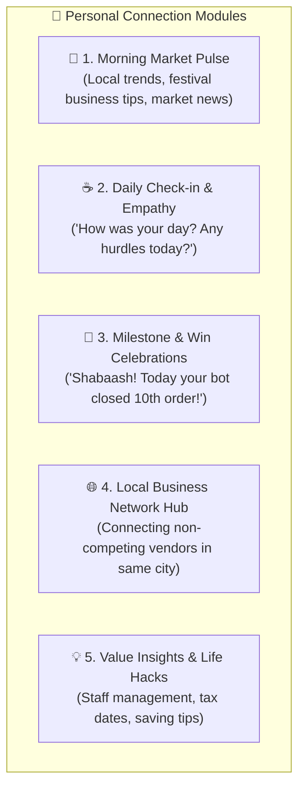

# 🤝 PERSONAL CONNECTION & FOUNDER COMPANION ENGINE ("AI SAATHI")

**Version:** 1.0.0  
**Target:** Building Deep Emotional Bonding, Community Trust, and Lifetime Loyalty with Business Owners  

---

## 1. Philosophy: "Not Just a Software, but a Trusted Business Companion"

Most SaaS tools are cold, boring, and faceless.  
Our platform creates a **warm, empathetic, and personal relationship** between the founder/company and the business owner.

The AI talks to the owner not like a robot, but like an intelligent, caring **"Business Partner / Saathi"** who understands their daily hustle, local market realities, and personal milestones.

---

## 2. The 5 Touchpoints of Personal Bonding

### 1. 🌅 Morning Market Pulse (8:30 AM)
- **Content:** Local market updates, upcoming festival opportunities, actionable sales tips.
- **Example Message:**
  > *"सुप्रभात शर्मा जी! ☀️  
  > इस हफ्ते नवरात्रि/दिवाली की खरीदारी शुरू हो रही है। आपके एरिया (इंदौर/जयपुर) में लोग होम डेकोर और इलेक्ट्रॉनिक्स ज्यादा सर्च कर रहे हैं।  
  > क्या आज दोपहर को अपने पुराने 500 ग्राहकों को 1 स्पेशल फेस्टिव ऑफर ब्रॉडकास्ट भेजें? मैंने टेम्पलेट रेडी रखा है!"*

---

### 2. ☕ Evening Care & Business Check-in (8:00 PM)
- **Content:** Empathetic listening, asking about store footfall, stress, and operational hurdles.
- **Example Message:**
  > *"नमस्ते वर्मा जी! आज दुकान कैसी रही? कोई ऐसा कस्टमर आया जिससे डील अटक गई हो?  
  > अगर कोई ग्राहक खास सवाल पूछ रहा था, तो मुझे बता दीजिए, मैं कल से उसका और बेहतर जवाब देना शुरू कर दूँगा।"*

---

### 3. 🎉 Milestone Celebrations & Affirmation (Instant Triggers)
- **When a target is hit:**
  > *"अरे वाह गुप्ता जी! 🚀  
  > आज आपके AI सेल्समैन ने आपकी दुकान की **50वीं सेल** पूरी करवा दी! बहुत-बहुत बधाई! ऐसे ही आगे बढ़ते रहें, हम हर कदम पर आपके साथ हैं।"*

---

### 4. 🌐 Local Network & Cross-Promotions (Community Power)
- Connecting non-competing business owners on our platform (e.g. A Solar Dealer + An Electrician, or A Doctor + A Medical Store).
- AI suggests collaborations: *"शर्मा जी, हमारे नेटवर्क में पास के एक इंटीरियर डिजाइनर हैं, क्या आप उनके साथ क्रॉस-रेफरल पार्टनरशिप करना चाहेंगे?"*

---

### 5. 👨‍💼 Founder's Personal Voice (Direct from YOU)
- Once a week, a genuine voice message or personal note from the platform founder:
  > *"नमस्ते! मैं [आपका नाम], Vismart का फाउंडर। मैं बस यह जानने के लिए मैसेज कर रहा हूँ कि क्या हमारा सिस्टम आपके बिजनेस को बढ़ाने में मदद कर रहा है? अगर आपको कोई भी परेशानी हो, तो आप सीधे मुझे रिप्लाई कर सकते हैं।"*

---

## 3. Business Impact of Emotional Bonding

1. **Zero Churn (अटूट भरोसा):** जब क्लाइंट को लगता है कि यह कंपनी सिर्फ पैसे नहीं ले रही बल्कि सच में उसके बिजनेस की चिंता करती है, तो वो जिंदगी भर जुड़ा रहता है।
2. **Word of Mouth (माउथ पब्लिसिटी):** खुश व्यापारी अपने 5 दूसरे व्यापारी दोस्तों को खुद बताएगा: *"भाई, ये सॉफ्टवेयर नहीं, मेरा सच्चा बिजनेस पार्टनर है!"*
