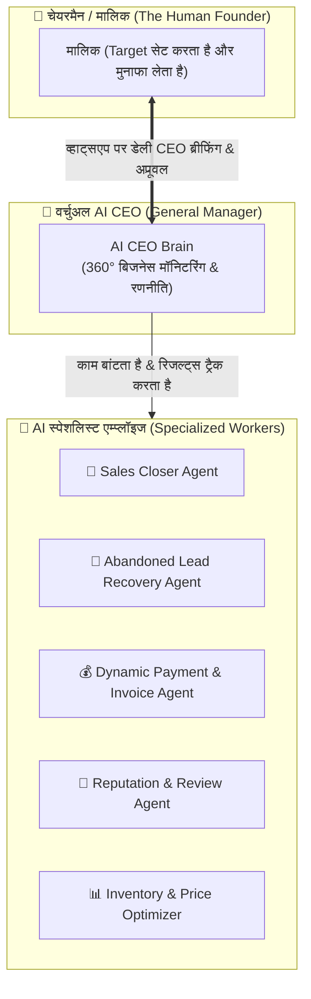

# 👑 VIRTUAL AI CEO & AUTONOMOUS EXECUTIVE ENGINE

**Version:** 1.0.0  
**Concept:** Appointing a 24/7 Virtual AI Chief Executive Officer (CEO/General Manager) over the Business  

---

## 1. Executive Hierarchy Overview

---

## 2. AI CEO की 4 मुख्य जिम्मेदारियां (Executive Duties)

### 1. 🎯 लक्ष्य प्राप्ति इंजन (Goal Maximizer):
- **मालिक ने लक्ष्य दिया:** *"इस महीने ₹5 लाख की सेल करनी है।"*
- **AI CEO का गणित:**  
  - *"₹5 लाख के लिए हमें ₹10,000 की 50 डील्स फाइनल करनी होंगी।"*
  - *"अभी पाइपलाइन में 180 लीड्स हैं। मुझे कन्वर्जन 28% पर ले जाना होगा।"*
  - *"मैं आज ही 45 ठंडी पड़ी लीड्स को स्पेशल फॉलो-अप भेज रहा हूँ और शुक्रवार को फेस्टिव ब्रॉडकास्ट रन करूँगा।"*

---

### 2. 🔍 बॉटलनैक और समस्याओं की ऑटो-पहचान (Proactive Problem Solver):
- AI CEO खुद डेटा देखकर मालिक को आगाह करेगा:
  > *"शर्मा जी, इस हफ्ते हमारी दुकान पर 40 नए ग्राहकों ने 'सोलर पैनल' पूछा, लेकिन 15 लोगों ने इसलिए मना कर दिया क्योंकि डिलीवरी टाइम 5 दिन था। क्या हम लोकल सप्लायर से 2-दिन की डिलीवरी की बात करें?"*

---

### 3. 📋 व्हाट्सएप पर डेली CEO एग्जीक्यूटिव ब्रीफिंग:
- **सुबह 9:00 बजे (कार्य योजना):**  
  *"सुप्रभात सर! आज हमारा टारगेट 4 नई बुकिंग क्लोज करने का है। मैंने 12 हॉट लीड्स को फॉलो-अप पर लगाया है।"*
- **रात 9:00 बजे (रिजल्ट रिपोर्ट):**  
  *"सर, आज का रिजल्ट: कुल ₹38,000 की वसूली हुई, 3 नई डील्स फाइनल हुईं, और 1 ग्राहक की शिकायत को सॉल्व कर दिया गया है।"*

---

### 4. ⚖️ प्राइसिंग और कॉम्पिटिशन इंटेलिजेंस:
- अगर मार्केट में किसी प्रॉडक्ट की डिमांड बढ़ रही है या ग्राहक डिस्काउंट मांग रहे हैं:
- AI CEO तुरंत मालिक से पूछेगा:  
  *"सर, अगर हम आज 5% का इंस्टेंट डिस्काउंट कूपन जारी करें, तो रुकी हुई 8 डील्स तुरंत आज ही क्लोज हो सकती हैं। क्या मैं इसे अप्रूव करूँ? (हाँ / नहीं)"*
