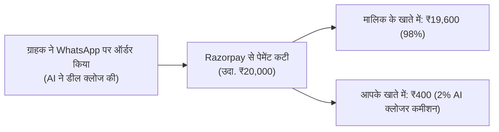

# 💰 PERFORMANCE COMMISSION & DYNAMIC VALUE-BASED PRICING

**Version:** 1.0.0  
**Target:** Outcome-Based Monetization, Sales Commission Engine, and Secret Custom Pricing  

---

## 1. Why Performance Commission is a Multi-Billion Dollar Model

In India, small and large businesses resist high fixed upfront software fees, but they **happily and eagerly pay a percentage on actual revenue generated**.

When you tell a business owner:
> *"अगर AI ने आपकी सेल करवाई, तभी हमें छोटा सा कमीशन देना — वरना आपका कोई रिस्क नहीं!"*
The sales friction drops to **ZERO**.

---

## 2. Industry-Wise Dynamic Pricing & Commission Structure

We do **NOT** show a flat public pricing table to everyone.  
The AI evaluates the business niche during the onboarding chat and offers a customized value-based model:

| इंडस्ट्री / बिजनेस | टिकट साइज (डील की कीमत) | मॉडल का प्रकार | हमारी कमाई (Your Revenue) |
| :--- | :--- | :--- | :--- |
| **1. सोलर रूफटॉप** | ₹1,50,000 – ₹3,00,000 | फिक्स्ड + पर-क्लोज्ड डील | **₹1,500 – ₹3,000 प्रति सफल इंस्टॉलेशन** |
| **2. रियल एस्टेट / प्रॉपर्टी** | ₹30,00,000 – ₹1,00,00,000 | साइट विजिट + टोकन बुकिंग | **₹5,000 – ₹10,000 प्रति कन्फर्म बुकिंग** |
| **3. कोचिंग इंस्टिट्यूट** | ₹20,000 – ₹60,000 | पर-एडमिशन सक्सेस फीस | **₹1,000 प्रति नया एडमिशन** |
| **4. डॉक्टर / डेंटल क्लिनिक** | ₹2,000 – ₹15,000 | पर-अपॉइंटमेंट कंसल्टेशन | **₹150 – ₹300 प्रति कन्फर्म पेशेंट** |
| **5. D2C / रिटेल शॉप** | ₹500 – ₹5,000 | ट्रांजैक्शन % या मंथली रेंट | **1.5% से 2.5% प्रति ऑर्डर या ₹999/माह** |

---

## 3. Secret Custom Quotation & Private Proposal Strategy

1. **नो पब्लिक प्राइसिंग पेज (No Public Flat Pricing):**
   - वेबसाइट पर कोई फिक्स ₹999 या ₹2,999 की खुली टेबल नहीं होगी।
   - वेबसाइट पर सिर्फ कॉल-टू-एक्शन होगा: **"अपने बिज़नेस के लिए AI सेल्स पार्टनरशिप कैलकुलेट करें"**।
2. **AI खुद प्रपोजल बनाएगा:**
   - जब कोई सोलर वाला आएगा, तो AI कहेगा: *"सर, हमारा मॉडल आपकी हर सोलर सेल पर सिर्फ 1% कमीशन पर काम करता है।"*
   - जब कोई डॉक्टर आएगा, तो AI कहेगा: *"सर, सिर्फ ₹200 प्रति पेशेंट बुकिंग।"*
3. **ऑटोमैटिक स्प्लिट पेमेंट्स (Razorpay Route / Split Payouts):**
   - जब ग्राहक WhatsApp पर पेमेंट लिंक से पे करता है:
   - Razorpay Route सिस्टम अपने आप 98% पैसा व्यापारी के खाते में और **2% आपका कमीशन सीधे आपके बैंक खाते में** सेकंड्स में ट्रांसफर कर देता है!
