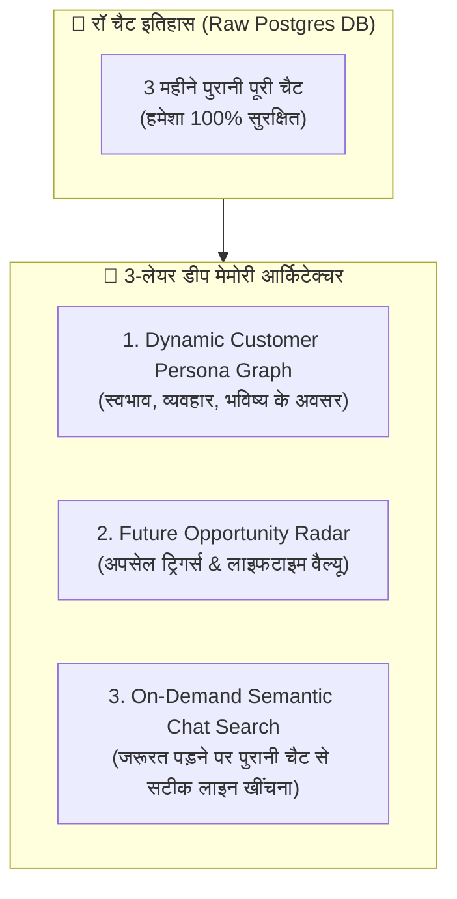

# 🧠 DYNAMIC CUSTOMER PERSONA GRAPH & DEEP ON-DEMAND RECALL

**Version:** 1.0.0  
**Target:** Infinite Behavioral Memory, Future Upsell Extraction, and Exact On-Demand Chat Recall  

---

## 1. The Core Philosophy: "True Human-Like Memory"

A flat 2-line summary is too shallow for an elite sales closer.  
An elite human salesman remembers:
1. **ग्राहक का स्वभाव (Behavioral Persona):** क्या वो भाव-ताव ज्यादा करता है? क्या वो टेक्निकल बातें पूछता है या क्वालिटी पर ध्यान देता है?
2. **भविष्य की कमाई के संकेत (Future Upsell Signals):** क्या उसने बातों-बातों में कहा था कि *"दीवाली पर दूसरी दुकान खोल रहा हूँ"* या *"नवंबर में बेटी की शादी है"*?
3. **सटीक पुरानी बातचीत (Exact Recall):** 3 महीने बाद भी अगर ग्राहक पूछे *"पिछली बार आपने क्या वादा किया था?"* — AI को वो सटीक बात याद होनी चाहिए।



---

## 2. Dynamic Customer Persona Graph (JSON Schema)

हर ग्राहक के लिए बैकएंड में एक रिच **"Persona Graph"** बनता है जो हर चैट के बाद ऑटो-अपडेट होता है:

```json
{
  "customer_id": "cust_9893123456",
  "name": "राहुल वर्मा",
  "personality_and_behavior": {
    "decision_maker": true,
    "price_sensitivity": "Medium",
    "trust_barrier": "Low (Already trusts brand)",
    "communication_style": "Hinglish, prefers Voice Notes, respectful",
    "urgency": "High (Wants installation before summer)"
  },
  "core_needs_and_budget": {
    "primary_requirement": "5kW Solar Rooftop for Home",
    "budget_range": "₹2,00,000 - ₹2,30,000",
    "key_objection": "Worried about DISCOM net-metering delay"
  },
  "future_revenue_opportunities": [
    {
      "opportunity": "Commercial Solar for Flour Mill (आटा चक्की)",
      "timeline": "Diwali 2026",
      "estimated_deal_value": "₹8,00,000",
      "trigger_context": "He mentioned during chat: 'Agar ghar ka setup accha raha to factory me bhi 25kW lagwaunga'"
    },
    {
      "opportunity": "Solar Water Heater",
      "timeline": "Winter (October)",
      "estimated_deal_value": "₹35,000"
    }
  ],
  "lifetime_value_score": 9.4
}
```

---

## 3. ऑन-डिमांड डीप रिकॉल (On-Demand Vector Search)

- **पूरी चैट कभी डिलीट नहीं होती:** पुरानी 10,000 लाइनें भी PostgreSQL में परमानेंट रहती हैं।
- **जब जरूरत पड़े (On-Demand):**
  - ग्राहक ने 6 महीने बाद पूछा: *"आपने 6 महीने पहले मुझे वारंटी पर क्या लिखकर दिया था?"*
  - AI पूरे 10,000 मैसेज नहीं पढ़ता (ताकि टोकन बिल न बढ़े)।
  - AI **Vector Semantic Search** चलाकर उस 6 महीने पुरानी चैट में से वही 2 लाइनें सेकंड्स में निकाल लेता है:  
    👉 *"राहुल जी! 14 मार्च को हमारी बात हुई थी और मैंने आपको इन्वर्टर पर 5 साल और पैनल्स पर 25 साल की वारंटी कन्फर्म की थी।"*
- **नतीजा:** ग्राहक पूरी तरह हैरान रह जाता है कि **"इस AI की याददाश्त तो किसी इंसान से भी 100 गुना ज्यादा तेज है!"**
