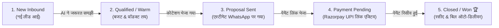

# 📊 AUTONOMOUS WHATSAPP CRM & KANBAN SALES PIPELINE

**Version:** 1.0.0  
**Target:** 100% Zero-Manual-Entry, Event-Driven WhatsApp CRM & Deals Pipeline  

---

## 1. Traditional CRM vs Our Autonomous AI CRM

| फीचर | आम पारंपरिक CRM (HubSpot/Zoho) | हमारा Autonomous WhatsApp CRM |
| :--- | :--- | :--- |
| **डेटा एंट्री** | सेल्समैन को मैन्युअली टाइप करके डालना पड़ता है | **AI चैट से खुद डेटा, नाम, बजट और जरूरतें निकाल लेता है (0% Manual Entry)** |
| **लीड स्टेटस बदलना** | मैन्युअली स्टेज बदलनी पड़ती है | **चैट इवेंट्स पर लीड्स अपने आप आगे खिसकती हैं (Auto-Kanban)** |
| **डील वैल्यू** | अंदाजे से टाइप की जाती है | **AI कोटेशन और पेमेंट लिंक के आधार पर सटीक रियल-टाइम वैल्यू ट्रैक होती है** |
| **फॉलो-अप** | सेल्समैन भूल जाता है | **सिस्टम खुद WhatsApp पर समय से फॉलो-अप मैसेज और कूपन भेजता है** |

---

## 2. CRM Architecture & Visual Kanban Pipeline

---

## 3. CRM के 4 मुख्य सुपर-फीचर्स

### 1. 📇 360° स्मार्ट कॉन्टैक्ट प्रोफाइल (Rich Customer Card):
- **बेसिक डेटा:** नाम, व्हाट्सएप नंबर, शहर, प्रोफाइल फोटो।
- **लाइफटाइम मैट्रिक्स:** कुल खरीदारी (LTV: ₹2,40,000), कुल ऑर्डर्स (3), लीड स्कोर (94/100 🔥)।
- **ऑटो-टैग्स:** `Solar-5kW`, `DISCOM-Domestic`, `Fast-Payer`, `VIP-Client`।
- **भविष्य के अवसर:** `Diwali Factory Solar (₹8 Lakh)`।

---

### 2. 🎛️ ड्रैग-एंड-ड्रॉप कानबान बोर्ड (Kanban Deals Pipeline):
- स्क्रीन पर 5 सुंदर कॉलम दिखेंगे।
- मालिक या सेल्स मैनेजर चाहे तो माउस से भी कार्ड्स इधर-उधर ड्रैग कर सकता है।
- हर कॉलम के ऊपर कुल डील वैल्यू दिखेगी:  
  *(उदा. Proposal Sent कॉलम में ₹12,50,000 की डील्स चल रही हैं)*।

---

### 3. 🎯 स्मार्ट फिल्टर्स और कस्टम ऑडियंस (Smart Segmentation):
- 1 क्लिक में लिस्ट फिल्टर करें:
  - *"वे सभी ग्राहक जिन्हें 15 दिन पहले कोटेशन भेजा था लेकिन अभी तक पेमेंट नहीं आई।"*
  - *"वे सभी पुराने ग्राहक जिनकी सर्विस 6 महीने में रिन्यू होनी है।"*
- **1-क्लिक एक्शन:** इस फिल्टर्ड लिस्ट को तुरंत एक स्पेशल WhatsApp ब्रॉडकास्ट ऑफर भेजें!

---

### 4. ⏰ ऑटोमैटिक टास्क & रिमाइंडर्स (Staff Tasks):
- अगर किसी ग्राहक ने कहा: *"मुझे कल शाम 4 बजे फोन करके साइट नापने आ जाना।"*
- AI तुरंत CRM में एक टास्क बना देगा और ठीक कल 3:30 बजे फील्ड इंजीनियर/स्टाफ के WhatsApp पर अलर्ट भेज देगा!
