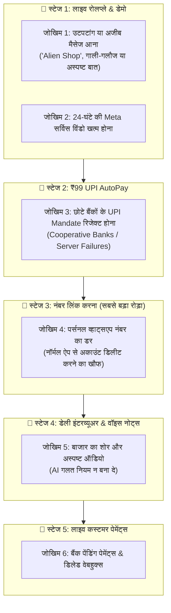

# ⚠️ PRACTICAL FLOW BOTTLENECKS & FAILSAFE SOLUTIONS (GROUND REALITY AUDIT)

**Version:** 1.0.0  
**Target:** Anticipating Real-World Edge Cases, Human Friction, and Technical Bottlenecks  

---

## 1. Ground Reality Flow Overview & Risk Points

---

## 2. 6 प्रैक्टिकल दिक्कतें और उनके अचूक समाधान (Failsafe Solutions)

---

### 🚨 1. दिक्कत: रोलप्ले में उटपटांग इनपुट (Gibberish / Abuse Input)
- **समस्या:** कुछ लोग मजे लेने के लिए लिखेंगे *"asdfgh"*, गाली देंगे या ऐसा बिजनेस लिखेंगे जो दुनिया में है ही नहीं। अगर AI अटक गया, तो डेमो खराब दिखेगा।
- **समाधान (Failsafe Guardrail):**
  - AI के पास **पसंदीदा 6 बटन (Quick Reply Buttons)** होंगे:  
    `[ ☀️ सोलर ]`, `[ 📚 कोचिंग ]`, `[ 🩺 क्लिनिक ]`, `[ 🏠 प्रॉपर्टी ]`, `[ 🛍️ दुकान ]`, `[ ✍️ अन्य ]`
  - अगर कोई अजीब टेक्स्ट आया, तो AI शालीनता से रीसेट करेगा:  
    *"कृपया ऊपर दिए गए बटनों में से अपना बिजनेस चुनें ताकि मैं सही रोलप्ले दिखा सकूँ।"*

---

### 🚨 2. दिक्कत: 24-घंटे की Meta विंडो (The 24h Window Rule)
- **समस्या:** जब कोई "Hi" भेजता है, तो आप 24 घंटे तक फ्री में चैट कर सकते हैं। लेकिन अगर वो 3 दिन बाद गायब हो गया, तो आप उसे फ्री टेक्स्ट नहीं भेज सकते (Meta ब्लॉक कर देगा)।
- **समाधान:** 24 घंटे के बाद फॉलो-अप केवल **Meta Pre-Approved Template Message** से ही जाएगा।

---

### 🚨 3. दिक्कत: कुछ बैंकों में UPI AutoPay फेल होना
- **समस्या:** भारत में 10-15% छोटे ग्रामीण या कॉपरेटिव बैंक UPI AutoPay ई-मैनडेट रिजेक्ट कर देते हैं।
- **समाधान (Dual Payment Fallback):**
  - अगर AutoPay फेल हुआ, तो सिस्टम तुरंत दूसरा ऑप्शन देगा:  
    👉 **"ऑटो-पे में दिक्कत आ रही है? सीधे ₹199 में 7 दिन का वन-टाइम ट्रायल पास लें।"** (इससे 1 भी क्लाइंट नहीं छूटेगा)।

---

### 🚨 4. दिक्कत: पर्सनल नंबर का डर (WhatsApp Number Friction - सबसे बड़ा मुद्दा)
- **समस्या:** Meta Cloud API के लिए नंबर नॉर्मल WhatsApp ऐप से हटाना पड़ता है। दुकानदार डरता है कि *"मेरे पुराने पारिवारिक चैट डिलीट न हो जाएं"**।
- **समाधान (3-Way Strategy):**
  1. **Option A (Best):** क्लाइंट को नया ₹50 का दूसरा सिम या बिजनेस नंबर इस्तेमाल करने की सलाह देना।
  2. **Option B:** अगर पुराना नंबर ही चाहिए, तो उसे समझाना कि पुराने चैट्स का बैकअप Google Drive पर सुरक्षित रहता है।
  3. **Option C (Cloud QR Agent):** हमारे पास क्लाइंट के नॉर्मल व्हाट्सएप को बिना ऐप से हटाए क्यूआर कोड स्कैन से जोड़ने का अल्टरनेटिव सपोर्ट भी बैकएंड में रखना।

---

### 🚨 5. दिक्कत: बाजार का शोर और अस्पष्ट वॉयस नोट
- **समस्या:** दुकानदार बाजार के शोरगुल में 2 सेकंड का ऑडियो भेजता है: *"हाँ ठीक है वो डिस्काउंट दे देना।"* AI गलत समझकर 50% डिस्काउंट का नियम न बना दे!
- **समाधान (Strict Confirmation Threshold):**
  - जब तक AI 95% श्योर न हो, तब तक डेटाबेस में कुछ नहीं जाएगा।
  - AI हमेशा मालिक से साफ शब्दों में **"हाँ/नहीं" (YES/NO)** पूछेगा। जब तक मालिक YES नहीं दबाता, वो नियम लाइव नहीं होगा!

---

### 🚨 6. दिक्कत: बैंक पेमेंट अटकना (Pending Webhook Callbacks)
- **समस्या:** ग्राहक ने UPI से पैसे भेजे, लेकिन बैंक का सर्वर स्लो होने के कारण स्टेटस 5 मिनट तक `pending` रहा। AI को ग्राहक से यह नहीं कहना चाहिए कि *"पेमेंट फेल हो गई"*।
- **समाधान:** AI कहेगा: *"आपकी पेमेंट बैंक से प्रोसेस हो रही है, 2 मिनट में रसीद आ रही है।"* और जैसे ही Razorpay का कन्फर्मेशन वेबहुक आएगा, तुरंत रसीद जाएगी।
