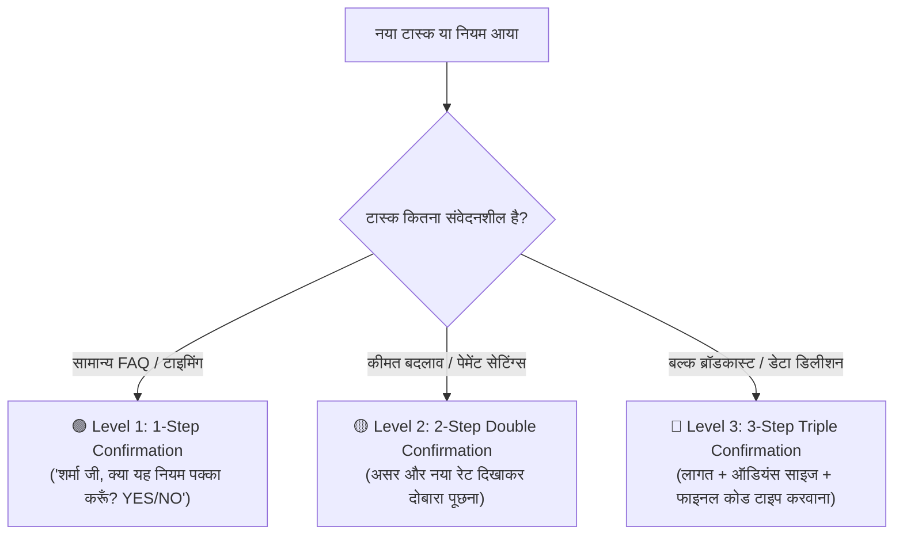

# 🛡️ HUMAN-IN-THE-LOOP MULTI-TIER CONFIRMATION & SAFETY PROTOCOL

**Version:** 1.0.0  
**Target:** 100% Risk Prevention, Strict Multi-Step Confirmation for Critical Actions, and Zero-Assumption Guarantee  

---

## 1. The Golden Law of Safety
> **"AI कभी भी मालिक की मर्जी के बिना अपनी मर्जी से कोई भी नियम, कीमत या कैंपेन सेट नहीं करेगा।"**

हर काम से पहले मालिक से स्पष्ट पूछा जाएगा, और **संवेदनशील/जोखिम भरे कामों (Critical Tasks) के लिए 2 से 3 बार दोबारा पुष्टि (Double/Triple Confirmation)** की जाएगी।

---

## 2. जोखिम के 3 स्तर और उनके कन्फर्मेशन नियम (3-Tier Protocol)

### 🟢 Level 1: सामान्य नियम (1-Step Confirmation)
- **उदाहरण:** दुकान खुलने का समय, रविवार की छुट्टी, डिलीवरी एरिया।
- **फ्लो:**
  - AI: *"शर्मा जी, मैंने नियम बनाया है: 'संडे को दुकान दोपहर 2 बजे तक खुलेगी'। क्या इसे पक्का कर दूँ? (हाँ / नहीं)"*
  - मालिक: *"हाँ"* ➡️ **नियम एक्टिव हुआ ✅**

---

### 🟡 Level 2: वित्तीय & प्राइसिंग बदलाव (2-Step Double Confirmation)
- **उदाहरण:** किसी प्रॉडक्ट की कीमत बदलना, डिस्काउंट कूपन जारी करना, UPI अकाउंट बदलना।
- **फ्लो:**
  - **स्टेप 1 (प्रस्ताव):**  
    AI: *"वर्मा जी, आपने 5kW सोलर का रेट ₹2,20,000 से घटाकर ₹2,00,000 करने को कहा है। क्या आप यह बदलाव चाहते हैं? (1: हाँ / 2: नहीं)"*
  - **मालिक:** *"1 (हाँ)"*
  - **स्टेप 2 (डबल कन्फर्मेशन & असर):**  
    AI: *"⚠️ ध्यान दें: इस बदलाव के बाद सभी नए ग्राहकों को ₹2,00,000 का ही कोटेशन जाएगा। क्या आप 100% श्योर हैं? कृपया पुष्टि के लिए 'CONFIRM' लिखें।"*
  - **मालिक:** *"CONFIRM"* ➡️ **कीमत अपडेट हुई ✅**

---

### 🔴 Level 3: हाई-रिस्क क्रिटिकल टास्क (3-Step Triple Confirmation)
- **उदाहरण:** 5,000 लोगों को एक साथ बल्क ब्रॉडकास्ट भेजना, पूरा डेटाबेस रीसेट करना।
- **फ्लो:**
  - **स्टेप 1 (कैंपेन प्रीव्यू):**  
    AI: *"गुप्ता जी, आप 2,500 ग्राहकों को 'दिवाली 20% ऑफ' का ब्रॉडकास्ट भेजने जा रहे हैं। मेटा का अनुमानित मैसेज चार्ज लगभग ₹2,000 होगा। क्या आगे बढ़ें? (हाँ / नहीं)"*
  - **मालिक:** *"हाँ"*
  - **स्टेप 2 (सुरक्षा चेतावनी):**  
    AI: *"⚠️ चेतावनी: ब्रॉडकास्ट शुरू होने के बाद इसे बीच में रोका नहीं जा सकेगा। मैसेज का नमूना ऊपर भेजा गया है। क्या सब कुछ सही है? (Reply 'PROCEED')"*
  - **मालिक:** *"PROCEED"*
  - **स्टेप 3 (फाइनल सेफ्टी कोड):**  
    AI: *"गलती से बटन दबने से बचने के लिए, कृपया फाइनल लॉन्च के लिए 'SEND 2500' टाइप करें।"*
  - **मालिक:** *"SEND 2500"* ➡️ **कैंपेन सुरक्षित रूप से लॉन्च हुआ 🚀**

---

## 3. डेटाबेस और ऑडिट ट्रेल (Security Log)
- हर कन्फर्मेशन का **समय, मालिक का फोन नंबर, और ओरिजिनल मैसेज टेक्स्ट** `audit_confirmation_logs` टेबल में परमानेंट सेव रहेगा।
- इससे कभी कोई भ्रम या विवाद नहीं होगा कि *"यह नियम किसने और कब चालू किया था"**।
