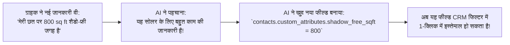
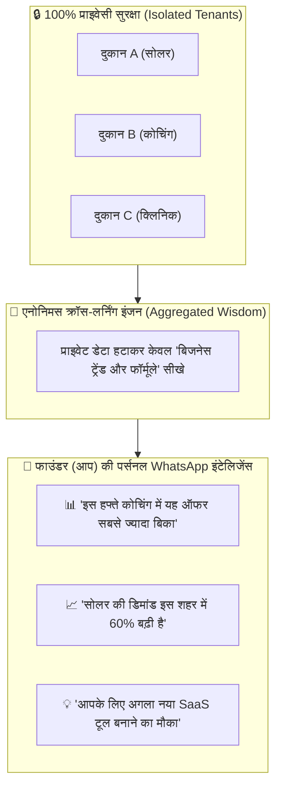

# 🧠 AUTONOMOUS SCHEMA EVOLUTION & FOUNDER META-INTELLIGENCE ENGINE

**Version:** 1.0.0  
**Target:** Dynamic JSONB Attribute Creation, Privacy-Preserving Cross-Business Learning, and Founder Macro Intelligence  

---

## 1. Dynamic Self-Extending Schema (Auto-Column Creation)

When the AI encounters new, high-value business attributes during customer chats, it does **NOT** crash on rigid SQL table structures.  
It dynamically creates and indexes new structured attributes inside PostgreSQL's flexible `custom_attributes (JSONB)` column.

---

## 2. Founder Meta-Intelligence Engine (The Billion-Dollar Moat)

> **"क्या हजारों बिजनेसेस से सीखकर AI खुद आपके (फाउंडर के) लिए बड़ा बिजनेस एडवाइजर बन सकता है?"**  
> 👉 **जवाब: 100% हाँ! यही दुनिया की सबसे बड़ी टेक कंपनियों (Amazon, Uber, Stripe) की असली ताकत है।**

---

## 3. फाउंडर को मिलने वाली 3 तरह की सुपर-इंटेलिजेंस (Weekly Founder Briefing):

### 1. 📊 हाई-कन्वर्जन सेल्स सीक्रेट्स (What Works Best):
- AI आपको बताएगा:  
  > *"फाउंडर साहब! हमारे प्लेटफॉर्म पर मौजूद 50 कोचिंग सेंटर्स के डेटा से पता चला है कि जो कोचिंग रात 8 बजे वॉयस नोट में डेमो भेजती है, उसका एडमिशन 45% ज्यादा होता है। हम यह फीचर सभी नए क्लाइंट्स के लिए डिफ़ॉल्ट चालू कर सकते हैं!"*

---

### 2. 📍 शहर और मार्केट ट्रेंड्स (Macro Market Radar):
- AI आपको अलर्ट करेगा:  
  > *"सर, पिछले 15 दिनों में जयपुर और इंदौर के 120 दुकानदारों के पास 'होम डिलीवरी' के सवाल 70% बढ़े हैं। क्या हम '1-Click Local Delivery' का नया ऐड-ऑन टूल लॉन्च करें? इससे आपकी मंथली कमाई ₹50,000 बढ़ जाएगी!"*

---

### 3. 🛡️ 100% डेटा प्राइवेसी और एथिकल सुरक्षा:
- **नियम:** किसी भी दुकान के ग्राहक का फ़ोन नंबर, नाम, या पर्सनल चैट किसी दूसरी दुकान के पास कभी नहीं जाएगा।
- **सीख:** सिर्फ **पैटर्न, रणनीति और सफलता का फॉर्मूला (Aggregated Wisdom)** आपके मास्टर AI के दिमाग में मजबूत होगा!
