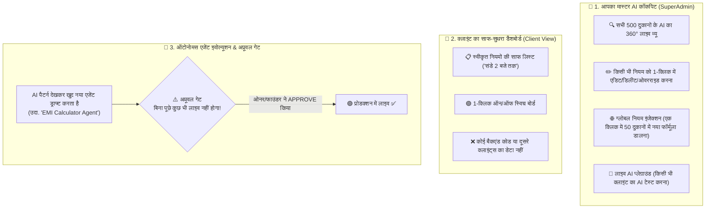

# 🎛️ AI MASTER CONTROL COCKPIT & AUTONOMOUS AGENT EVOLUTION ENGINE

**Version:** 1.0.0  
**Target:** 100% Granular SuperAdmin Control, Scoped Client Views, Autonomous Agent Drafting, and Strict Human Approval Gate  

---

## 1. The Dual-Cockpit Architecture Overview

---

## 2. SuperAdmin AI Master Control Cockpit (आपके पास)

### A. 360° AI इंस्पेक्टर और नॉलेज ग्रिड:
- आप किसी भी दुकान (जैसे: *शर्मा इलेक्ट्रॉनिक्स*) को चुनेंगे, तो आपको दिखेगा:
  - इस दुकान के AI ने अब तक कुल कितने नियम सीखे हैं।
  - हर नियम का **कॉन्फिडेंस स्कोर (Confidence Score: 98%)**।
  - किस नियम की वजह से सबसे ज्यादा डील्स क्लोज हुईं।
- **1-क्लिक एडिट & डिलीट:** आप किसी भी गलत नियम को तुरंत सुधार सकते हैं।

### B. ग्लोबल मास्टर इंजेक्शन (Global Rule Injection):
- अगर आपने कोई नया जबरदस्त सेल्स क्लोजिंग फॉर्मूला बनाया:
- आप 1 क्लिक में उसे अपनी कैटेगरी के **सभी 50 कोचिंग या 100 सोलर क्लाइंट्स के AI में एक साथ इंजेक्ट** कर सकते हैं!

---

## 3. ऑटोनोमस एजेंट इवोल्यूशन (AI का खुद नए सिस्टम बनाना)

जब AI लगातार ग्राहकों से बात करेगा, तो वो नए पैटर्न पहचानकर खुद नए एजेंट्स ड्राफ्ट करेगा:

1. **पैटर्न की पहचान:**  
   AI ने देखा कि पिछले 7 दिनों में 45 ग्राहकों ने पूछा: *"क्या 0% ब्याज पर EMI मिलेगी?"*
2. **ऑटो-ड्राफ्टिंग (Self-Drafting):**  
   AI ने खुद बैकएंड में एक **"Bajaj Finserv EMI Calculator Agent"** तैयार कर लिया।
3. **अप्रूवल गेट (The Safety Lock):**  
   AI इसे खुद चालू नहीं करेगा। वो ओनर और आपको WhatsApp + डैशबोर्ड पर कार्ड भेजेगा:  
   > *"शर्मा जी, 45 ग्राहकों ने EMI के बारे में पूछा था, इसलिए मैंने आपकी दुकान के लिए एक 'EMI कैलकुलेटर AI एजेंट' तैयार किया है।*  
   > 📌 **सैंपल चैट:** ग्राहक जब EMI पूछेगा, तो यह डाउन पेमेंट और 6 महीने की किस्त बता देगा।  
   > **क्या मैं इसे चालू कर दूँ? [ ✅ अप्रूव करें ] [ ✏️ एडिट करें ] [ ❌ रिजेक्ट करें ]"**
4. **मालिक के 'APPROVE' दबाते ही:** वो नया एजेंट उसकी दुकान में लाइव हो जाएगा!

---

## 4. विजुअल और आसान यूआई (Beautiful Card UI)
- हर नियम और एजेंट एक सुंदर कार्ड की तरह दिखेगा।
- **लाइव स्टेटस बैज:**
  - 🟢 **ACTIVE (स्वीकृत और चालू)**
  - 🟡 **PENDING APPROVAL (AI ने नया बनाया है, आपकी अनुमति का इंतजार है)**
  - 🔴 **DISABLED (बंद किया गया)**
- कोई भी गैर-टेक्निकल इंसान भी इसे 10 सेकंड में समझकर चला सकता है!
