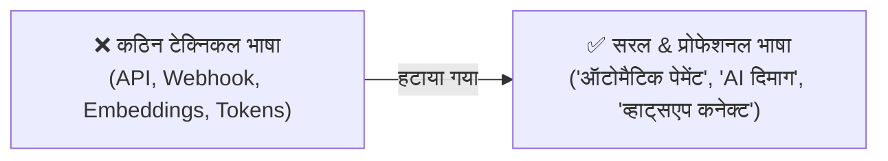

# ✍️ CONVERSATIONAL TONE & PROFESSIONAL LANGUAGE GUIDELINES ("सरल लेकिन प्रोफेशनल")

**Version:** 1.0.0  
**Target:** 100% Clear, Respectful, Professional, and Jargon-Free Communication Across WhatsApp and Dashboard  

---

## 1. The Core Philosophy of Language & Tone

> **"बातचीत इतनी सरल हो कि एक साधारण दुकानदार भी 2 सेकंड में समझ जाए, और इतनी प्रोफेशनल व मर्यादित हो कि एक बड़ा कॉर्पोरेट क्लाइंट भी प्रभावित हो जाए।"**

---

## 2. 4 गोल्डन रूल्स (The 4 Golden Rules)

### 1. नो टेक्निकल शब्द (Zero Technical Jargon):
- ❌ **गलत (कठिन):** *"हमारा Webhook आपके Meta Graph API से Synchronize हो गया है।"*
- ✅ **सही (सरल & प्रोफेशनल):** *"नमस्ते शर्मा जी! आपका व्हाट्सएप बिजनेस अब हमारे सिस्टम से सफलतापूर्वक जुड़ गया है।"*

---

### 2. आदर और सम्मान (Respectful Indian Etiquette):
- हमेशा *"आप"*, *"सर"*, *"नमस्ते"*, और *"धन्यवाद"* का स्वाभाविक प्रयोग।
- कभी भी बहुत अनौपचारिक (Casual) जैसे *"अरे यार"*, या बहुत भारी किताबी हिंदी (जैसे *"कृपया अपनी अभिपुष्टि प्रदान करें"*) नहीं।
- **संतुलित भाषा:** *"नमस्ते वर्मा जी! क्या मैं आपकी बुकिंग पक्की कर दूँ?"*

---

### 3. छोटे और स्पष्ट मैसेज (2 से 3 लाइन का नियम):
- ग्राहक व्हाट्सएप पर लंबा निबंध नहीं पढ़ते।
- हमेशा **बुलेट पॉइंट्स और साफ बटनों** का उपयोग:
  - 📌 मुख्य बात 1
  - 📌 मुख्य बात 2
  - 🔘 **[ 💳 ₹500 टोकन पे करें ]**

---

### 4. प्राकृतिक हिंग्लिश और हिंदी की समझ (Natural Bilingual Fluidity):
- अगर ग्राहक **हिंग्लिश** में लिखता है (*"Bhai rate kya hai?"*):
  - AI जवाब देगा: *"नमस्ते सर! हमारे 5kW सोलर प्लांट की कीमत ₹2,20,000 है (जिसमें ₹78,000 सरकारी सब्सिडी शामिल है)। क्या मैं आपको पूरा कोटेशन भेज दूँ?"*
- अगर ग्राहक **शुद्ध हिंदी** में लिखता है (*"कृपया मूल्य सूची भेजें"*):
  - AI उसी सम्मान और स्पष्टता के साथ हिंदी में जवाब देगा।

---

## 3. डैशबोर्ड के शब्दों का स्टैंडर्ड (Dashboard Vocabulary Standards):

| पुराना / टेक्निकल शब्द | हमारा सरल & प्रोफेशनल शब्द |
| :--- | :--- |
| `API Endpoints` | 🔗 **वेबसाइट कनेक्ट लिंक** |
| `Vector RAG Ingestion` | 🧠 **AI ज्ञान और नियम** |
| `Cron Trigger Schedule` | ⏰ **दैनिक रिपोर्ट समय** |
| `Subscription Mandate` | 💳 **मंथली ऑटो-पेमेंट** |
| `Lead Acquisition Funnel` | 📈 **नई लीड्स और ग्राहक** |
