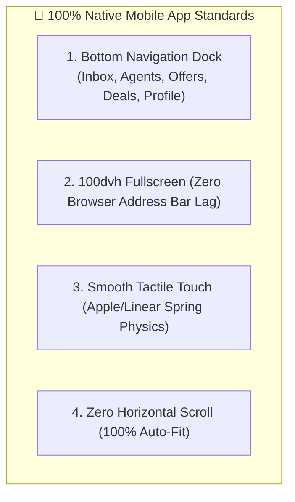

# 📱 MOBILE NATIVE-APP EXPERIENCE & SIMPLE AGENT CONFIGURATION STUDIO

**Version:** 1.0.0  
**Target:** Simple Executive English UI, 100% Native Mobile App Look, and Radical 3-Field Simple AI Agent Studio  

---

## 1. Executive Simple English UI Vocabulary Standards

The website, buttons, and navigation use **clean, crisp, international-grade Simple English** (No confusing tech jargon):

```
+-----------------------------------------------------------------------------------------+
| [⚡ Vismart AI]       WhatsApp: 🟢 Active       Plan: Pro Growth       [👤 My Store]    |
+-----------------------------------------------------------------------------------------+
|                                                                                         |
|  [ 📈 Today's Leads: 28 ]  [ 🤖 AI Closed: 24 ]  [ 💰 Revenue: ₹42,500 ]  [ ⚡ 1.8s ]   |
|                                                                                         |
+-----------------------------------------------------------------------------------------+
|  [ 💬 Live Inbox ]  |  [ 🤖 AI Agents ]  |  [ 📨 Send Broadcast ]  |  [ 📊 Sales Board ]|
+-----------------------------------------------------------------------------------------+
```

### Clean Button Labels (Simple & Direct English):
- `[ 💬 Live Inbox ]` (Live customer chats)
- `[ 🤖 AI Agents ]` (Turn agents on/off)
- `[ 📨 Send Broadcast ]` (Send festive/discount offers)
- `[ 📊 Sales Board ]` (View lead stages & closed deals)
- `[ 💳 Send Payment Link ]`
- `[ 📄 Send Brochure ]`
- `[ 🛑 Pause AI ]` / `[ 🤖 Resume AI ]`
- `[ ➕ Teach AI New Rule ]`

---

## 2. Mobile Native-App Experience (PWA Mobile Standards)

When a business owner opens `vismart.cloud` on their mobile phone (Chrome/Safari), it looks and feels **100% like a native iPhone/Android App**:



---

## 3. Simple AI Agent Configuration Studio (3-Field Setup)

The owner doesn't need to write complex AI prompts. Clicking on any agent opens a clean **3-step visual card**:

```
+---------------------------------------------------------------------------+
| 🛒 Configure: Sales Closer Agent                                          |
+---------------------------------------------------------------------------+
|                                                                           |
| 1. Primary Goal:                                                          |
|    (o) Close orders & collect payments                                    |
|    ( ) Book appointment / site visits                                     |
|    ( ) Just answer customer queries                                       |
|                                                                           |
| 2. Welcome Message:                                                       |
|    [ Hello! Welcome to Sharma Electronics. How can I help you today?    ] |
|                                                                           |
| 3. Maximum Allowed Discount:                                              |
|    [ 10% Off Max ]  (AI will never negotiate beyond this limit)           |
|                                                                           |
| 4. Primary Language:                                                      |
|    [ Hinglish (Natural Mix) v ]                                           |
|                                                                           |
| [ 💾 Save & Activate Agent ]                                              |
+---------------------------------------------------------------------------+
```

- **Zero Coding:** Just 3 simple dropdowns/inputs.
- **Instant Activation:** AI automatically compiles the background prompt, guardrails, and pricing rules!
