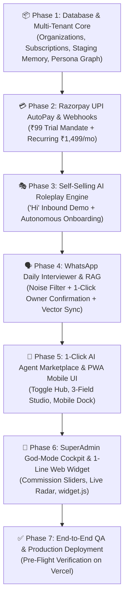

# 🚀 STEP-BY-STEP IMPLEMENTATION & EXECUTION PLAN (PLAN.MD)

**Project:** Vismart AI Suite  
**Execution Methodology:** Phased Modular Engineering, Battle-Tested Code Reuse, and Strict Pre-Flight Verification  

---

## 🗺️ Master Implementation Phases Overview

---

## 📋 Detailed Task Checklist

### Phase 1: Database Schema & Multi-Tenant Foundation
- [x] Create Supabase SQL migration `043_vismart_enterprise_core.sql`:
  - `organizations` / `subscriptions` (Razorpay mandate & commission tracking)
  - `temp_knowledge_staging` (Noise filtration & approval queue)
  - `enabled_agents` (1-click marketplace toggles)
  - `customer_personas` (Dynamic behavioral & future upsell graph)
  - `audit_confirmation_logs` (Security & multi-tier approval logs)
- [x] Set up PostgreSQL Row-Level Security (RLS) policies for all new tables.

### Phase 2: Razorpay UPI AutoPay Engine
- [x] Create `/api/billing/razorpay-initiate`: Generates ₹99 trial mandate plan.
- [x] Create `/api/billing/razorpay-webhook`: Listens for `subscription.authenticated`, `subscription.charged`, and `subscription.halted`.
- [x] Implement 3-day graceful retry handling.

### Phase 3: Self-Selling AI Roleplay Engine
- [x] Implement in `src/lib/ai/self-selling-roleplay.ts`:
  - Inbound state machine (`AWAITING_NICHE` ➡️ `LIVE_ROLEPLAY` ➡️ `PITCH_CLOSING` ➡️ `PAYMENT_LINK`).
  - 6 One-click Quick Reply buttons for clean onboarding.
  - Razorpay payment link dispatch inside chat.

### Phase 4: WhatsApp Daily Owner Interviewer & Contextual RAG
- [x] Create `src/lib/ai/daily-interviewer.ts` staging knowledge engine.
- [x] Build 1-click WhatsApp confirmation loop (`YES` / `NO`).
- [x] Connect contextual RAG promotion into `ai_knowledge` table.

### Phase 5: 1-Click AI Agent Marketplace & Mobile PWA UI
- [x] Build `/agents` marketplace page with 1-click toggle switches (`Sales Closer`, `Booking`, `Payment`, `Recovery`, `Voice Notes`).
- [x] Build 3-Field Simple Agent Configuration Modal (`ai-agent-marketplace.tsx`).
- [x] Build Mobile Bottom Navigation Dock (`mobile-nav-dock.tsx`).

### Phase 6: SuperAdmin God-Mode Cockpit & 1-Line Web Widget
- [x] Build `/superadmin` master dashboard with custom commission sliders, global AI rule injection, and live revenue telemetry.
- [x] Build `/public/widget.js` 1-line JavaScript live chat embed for client websites.

### Phase 7: Pre-Flight Verification & Vercel Deployment
- [x] Run `npm run typecheck` — 100% clean TypeScript build (0 errors).
- [ ] Deploy live update to Vercel production.
