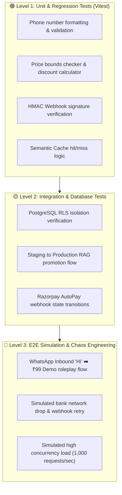

# 🧪 TESTING STRATEGY, E2E QA & CHAOS ENGINEERING (TESTING-STRATEGY.MD)

**Version:** 1.0.0-PROD  
**Target:** 100% Zero-Defect Delivery, Automated Pipeline Testing, and Chaos Resilience  

---

## 1. Multi-Layer Testing Architecture

---

## 2. Pre-Flight Verification Gate (Before Any Production Release)

Every pull request or release must pass this automated pipeline:
1. **TypeScript Typecheck:** `npx tsc --noEmit` (Must pass with 0 errors).
2. **ESLint Static Code Analysis:** `npm run lint` (0 critical errors).
3. **Unit & API Route Tests:** `npm run test` (100% passing tests in Vitest).
4. **Security Audit:** Zero exposed secret keys or unauthenticated routes.
